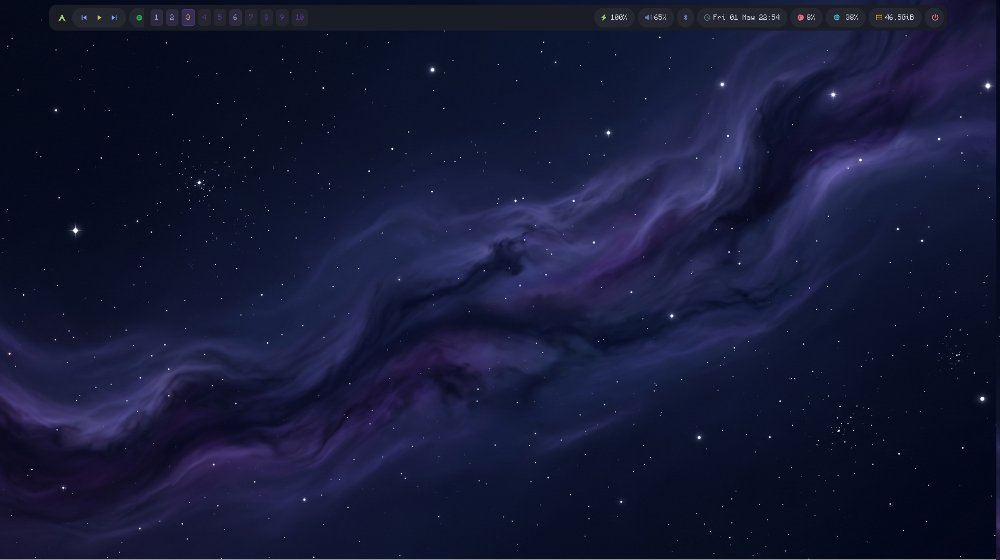
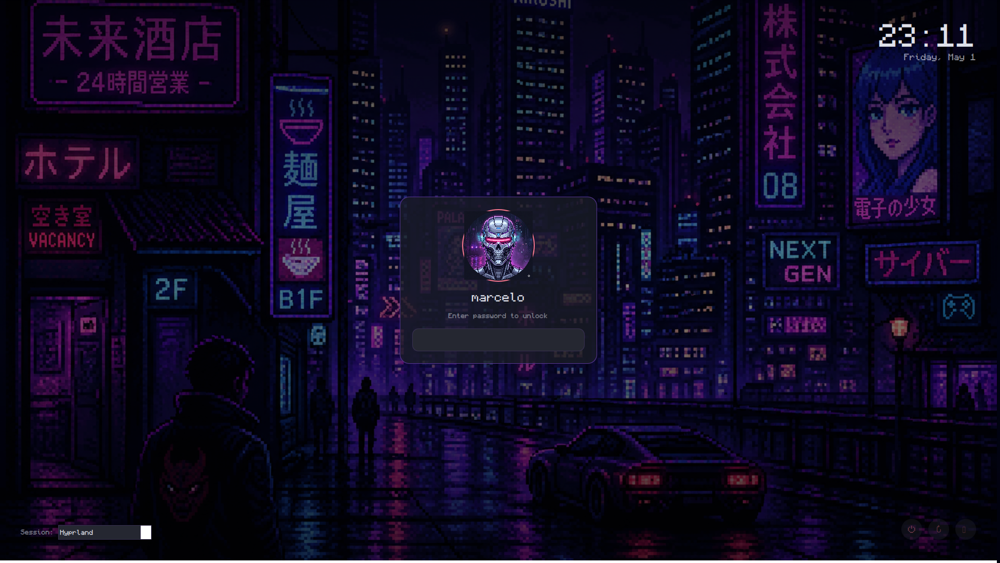
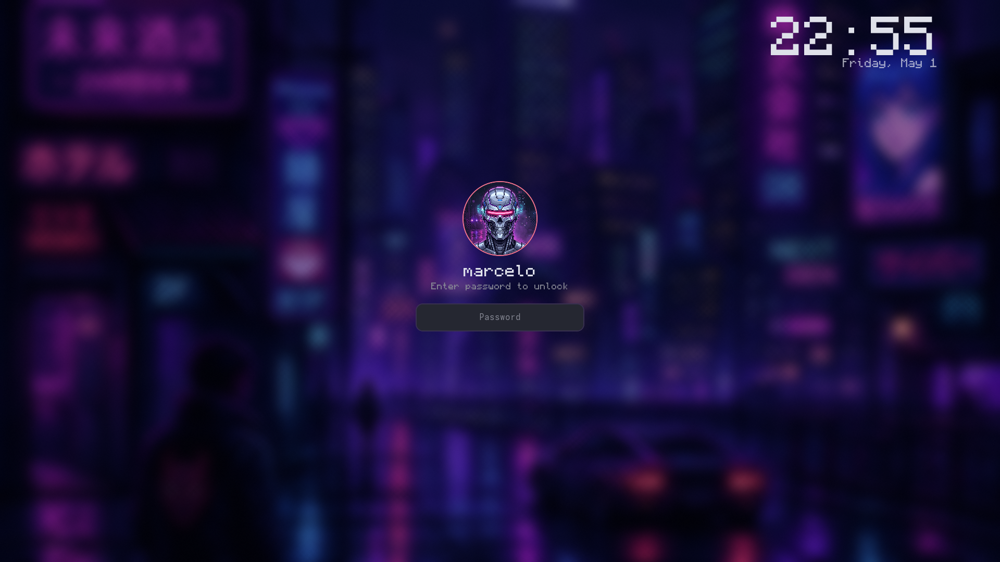

# Arch Linux Dotfiles

Hyprland (Wayland) setup with a unified dark neon palette across waybar, wofi,
kitty, hyprlock, and a custom SDDM theme. Tokyo-Night-ish surfaces, cyberpunk
pink/purple accents, Monocraft + Nerd Font typography.





> Drop the matching PNGs into `screenshots/` — see `screenshots/README.md` for capture commands.

---

## Layout

User-level configs use a [GNU Stow](https://www.gnu.org/software/stow/) style
layout: each top-level dir is a "package" whose contents mirror your `$HOME`.

| Package | What it ships | Stowed to |
|---|---|---|
| `hypr/` | Hyprland config, hyprlock config, helper scripts | `~/.config/hypr/` |
| `waybar/` | Bar config, CSS, scripts | `~/.config/waybar/` |
| `wofi/` | Launcher + powermenu | `~/.config/wofi/` |
| `kitty/` | Terminal config | `~/.config/kitty/` |
| `yazi/` | File manager | `~/.config/yazi/` |
| `gtk/` | GTK 2 theme | `~/.gtkrc-2.0` etc. |
| `shell/` | `.bashrc`, `.zshrc`, `.xprofile`, etc. | `$HOME` |
| `wallpapers/` | Wallpaper images (rotated by `awww-daemon`) | `~/wallpapers/` |
| `sddm/` | Custom SDDM login theme — **system-level**, not stowed | see `sddm/README.md` |

---

## Quick install

```bash
# 1. Clone
git clone https://github.com/MarceloSavian/arch.git ~/arch
cd ~/arch

# 2. Install packages (see the table below for what each is for)
sudo pacman -S --needed \
    hyprland hyprlock hypridle hyprpaper \
    waybar wofi kitty yazi \
    sddm qt5-graphicaleffects \
    grim slurp swappy wl-clipboard cliphist \
    brightnessctl playerctl pavucontrol \
    polkit-kde-agent network-manager-applet blueman \
    thunar tesseract jq stow rsync \
    noto-fonts noto-fonts-emoji ttf-font-awesome ttf-nerd-fonts-symbols

# AUR (use yay or paru)
yay -S --needed \
    awww \
    ttf-monocraft \
    ttf-input-nerd \
    bibata-cursor-theme \
    swaync \
    ckb-next

# 3. Stow the user configs
stow -v -t ~ hypr waybar wofi kitty yazi gtk shell

# 4. Drop wallpapers in place
mkdir -p ~/wallpapers && cp wallpapers/wallpapers/*.png ~/wallpapers/

# 5. Install + activate the SDDM theme
sudo cp -r sddm/cyberpunk-mr /usr/share/sddm/themes/
sudo chown -R root:root /usr/share/sddm/themes/cyberpunk-mr
sudo chmod -R a+rX    /usr/share/sddm/themes/cyberpunk-mr
sudo install -d /etc/sddm.conf.d
echo -e "[Theme]\nCurrent=cyberpunk-mr" | sudo tee /etc/sddm.conf.d/theme.conf

# 6. Enable services
sudo systemctl enable sddm
systemctl --user enable --now hypridle  # optional: idle/lid lock
```

Reboot (or `sudo systemctl restart sddm` from a TTY) and you're in.

---

## What each package does

### Wayland / compositor

| Package | Purpose |
|---|---|
| `hyprland` | Wayland compositor |
| `hyprlock` | Lock screen (bound to `SUPER+SHIFT+Q`) |
| `hypridle` | Idle daemon — auto-lock on inactivity / lid close |
| `awww` | Wallpaper daemon (`awww-daemon` rotates `~/wallpapers/` every 10 min) |

### Bar / launchers / shell

| Package | Purpose |
|---|---|
| `waybar` | Top status bar (sketchybar-style pill modules) |
| `wofi` | App launcher + powermenu (bound to `SUPER+D` / `SUPER+B`) |
| `swaync` | Notification daemon |
| `kitty` | Terminal |
| `yazi` | TUI file manager (bound to `SUPER+E`) |

### Login

| Package | Purpose |
|---|---|
| `sddm` | Display manager that renders the login theme in `sddm/cyberpunk-mr/` |
| `qt5-graphicaleffects` | Required for blur / fancy effects in the SDDM theme |

### Utilities pulled in by keybinds / scripts

| Package | What it's for |
|---|---|
| `grim` + `slurp` + `swappy` | Screenshots (`SUPER+PRINT`, `CTRL+SHIFT+4`) |
| `wl-clipboard` + `cliphist` | Clipboard history |
| `brightnessctl` | Brightness keys |
| `playerctl` | Media keys |
| `pavucontrol` | GUI audio mixer |
| `polkit-kde-agent` | Auth prompts (sudo dialogs) |
| `tesseract` | OCR for `SUPER+O` (screenshot → clipboard text) |
| `blueman` | Bluetooth tray |
| `network-manager-applet` | Network tray |
| `ckb-next` | Corsair keyboard daemon |
| `bibata-cursor-theme` | Cursor theme |

### Fonts

The whole UI assumes:

- `ttf-monocraft` — primary UI font
- `ttf-input-nerd` (Nerd Font variant of Input Mono) — fallback + glyphs
- `ttf-font-awesome` — waybar icon glyphs
- Material Icons + Material Design Icons — used by some pill modules

If a font is missing, waybar / wofi will fall back silently but icons may render as tofu.

---

## Manual / per-machine bits

### `awww` wallpaper daemon

`hypr/.config/hypr/scripts/rotate-wallpaper.sh` rotates `~/wallpapers/` every
10 minutes. Adjust `INTERVAL` inside the script.

### Display layout

`hyprland.conf` hardcodes two monitors:

```
monitor = HDMI-A-1,2560x1440@144,1920x0,1
monitor = eDP-1,1920x1080@60,0x0,1
```

Edit those lines or replace with `monitor=,preferred,auto,1` for autodetect.

### NVIDIA env vars

The `env =` block at the top of `hyprland.conf` is NVIDIA-specific. Strip
those lines on AMD / Intel.

---

## Reproducing this setup with an AI

Hand this README + the `~/arch/` repo URL to an AI agent and tell it:

> "Reproduce the setup described in `https://github.com/MarceloSavian/arch`
> on a fresh Arch install. Use the package list and install commands in
> `README.md`. Stow the user configs, install the SDDM theme, enable sddm.
> Don't push anything; show me each command before running it."

The package list, stow commands, and SDDM install steps above are written
to be copy-pasteable. The agent should be able to walk a clean machine to
a working state without further input beyond confirming sudo commands.

---

## Keybinds cheatsheet

| Keys | Action |
|---|---|
| `SUPER+RETURN` | Open kitty |
| `SUPER+Q` | Close window |
| `CTRL+Q` | Lock screen (hyprlock) |
| `SUPER+D` | App launcher (wofi) |
| `SUPER+B` | Power menu |
| `SUPER+E` | File manager (yazi in kitty) |
| `SUPER+W` | Workspace overview (eww) |
| `SUPER+SHIFT+W` | Shuffle wallpaper |
| `SUPER+O` | OCR screenshot region → clipboard |
| `SUPER+PRINT` | Freeze + screenshot full screen |
| `PRINT` | Freeze + screenshot region |
| `CTRL+SHIFT+4` | Quick region screenshot to `~/Pictures/Screenshots/` |
| `SUPER+SHIFT+R` | Reload Hyprland |
| `SUPER+1..9,0` | Jump to workspace |
| `SUPER+SHIFT+1..9,0` | Move window to workspace |
